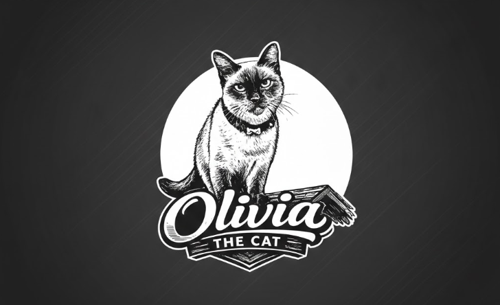

# 🐱 Olivia the Cat! IMG - Galería Estilo Pinterest

Aplicación web interactiva estilo **Pinterest** dedicada a la reina felina **Olivia the Cat**, con diseño moderno, almacenamiento en **Cloudinary** (organizado por carpetas) y hosting & autenticación con **Firebase**.



---

## ✨ Características Principales

1. **Estética Pinterest Moderna (Dark Luxury)**:
   - Cuadrícula estilo **Masonry multi-columna responsiva**.
   - Efectos hover elegantes con botones de acción directa: **Guardar**, **Ronroneo / Me Gusta** (con explosión de confetti 🎉), **Compartir** y **Descargar**.
   - Insignias de carpetas Cloudinary en cada Pin.

2. **Portada / Hero Oficial de Olivia the Cat**:
   - Destaca la ilustración oficial de Olivia con resplandor dorado animado.
   - Estadísticas en tiempo real (Pines activos, Carpetas, Ronroneos totales, Estado de Firebase).
   - Botón para contraer/expandir la portada para máxima inmersión visual.

3. **Almacenamiento en Cloudinary con Carpetas**:
   - Subida directa cliente-servidor mediante **Cloudinary Unsigned Upload API**.
   - Organización automática en carpetas:
     - `olivia-cat/portraits` (👑 Retratos Reales)
     - `olivia-cat/sleepy` (💤 Modo Siesta & Ronroneo)
     - `olivia-cat/adventures` (🌿 Aventuras & Jardín)
     - `olivia-cat/cozy` (🧶 Rincones Cálidos)
     - `olivia-cat/playtime` (⚡ Travesuras & Juegos)
     - `olivia-cat/memes` (😹 Caritas & Memes)
     - Posibilidad de crear **carpetas personalizadas** directamente desde la interfaz.
   - Panel de Ajustes para configurar `cloud_name` y `upload_preset`.

4. **Autenticación y Hosting con Firebase**:
   - Proyecto configurado: `oliviathecatimg` (`oliviathecatimg.firebaseapp.com`).
   - Base de datos en tiempo real: `https://oliviathecatimg-default-rtdb.firebaseio.com`.
   - Métodos de autenticación:
     - **Google Sign-In** con 1 clic.
     - **Correo y Contraseña** (Registro e Inicio de sesión).
     - **Modo Invitado / Anónimo**.
   - Sincronización en tiempo real de pines, likes, comentarios y favoritos con respaldo local automático en `localStorage`.

5. **Modal de Detalle del Pin (Pinterest Pin View)**:
   - Visualización de alta resolución.
   - Enlace directo a Cloudinary y descarga instantánea.
   - Etiquetas clickeables para filtrado rápido.
   - Hilo interactivo de comentarios en vivo.
   - Tarjeta de autor con fecha y likes.

6. **Búsqueda y Filtros en Tiempo Real**:
   - Búsqueda instantánea por título, descripción, etiquetas y carpetas.
   - Barra horizontal de carpetas con conteo de pines por categoría.

---

## 🚀 Inicio Rápido Local

Para correr el proyecto en tu máquina:

```bash
# 1. Instalar dependencias
npm install

# 2. Iniciar servidor de desarrollo
npm run dev
```

Abre tu navegador en `http://localhost:3000` para disfrutar de la experiencia.

---

## ☁️ Configuración de Cloudinary

Para subir tus propias imágenes directamente a tu cuenta de Cloudinary:

1. Ve a [Cloudinary Console](https://console.cloudinary.com/).
2. Haz clic en el ícono de **Settings** (⚙️) y ve a la pestaña **Upload**.
3. Baja hasta **Upload presets** y haz clic en **Add upload preset**.
4. En **Signing Mode**, selecciona **Unsigned**.
5. Ponle un nombre (por ejemplo: `olivia_pins`).
6. En la aplicación web **Olivia the Cat! IMG**, abre el botón de **Nube** (Ajustes) en la barra de navegación e introduce:
   - **Cloud Name**: Tu nombre de nube de Cloudinary.
   - **Upload Preset**: El nombre del preset no firmado que acabas de crear.
7. ¡Listo! Todas las fotos se subirán y organizarán en carpetas de Cloudinary automáticamente.

---

## 🔥 Despliegue en Firebase Hosting

El proyecto ya incluye `firebase.json` y `.firebaserc` configurados para el proyecto `oliviathecatimg`:

```bash
# 1. Compilar para producción
npm run build

# 2. Desplegar en Firebase Hosting
npx firebase-tools deploy --only hosting
```

Tu app estará en vivo en:
👉 `https://oliviathecatimg.web.app` o `https://oliviathecatimg.firebaseapp.com`
